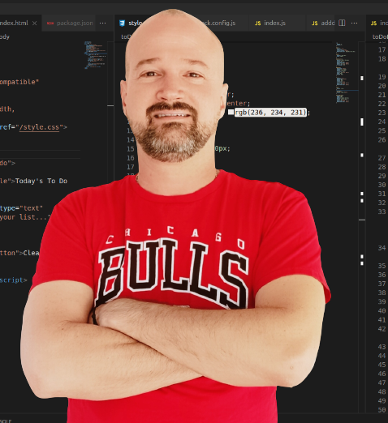

<a name="readme-top"></a>

<div align="center">

  
  <br/>

  <h3><b></b></h3>

</div>

<!-- TABLE OF CONTENTS -->

# 📗 Table of Contents

- [📖 About the Project](#about-project)
  - [🛠 Built With](#built-with)
    - [Tech Stack](#tech-stack)
    - [Key Features](#key-features)
  - [🚀 Live Demo](#live-demo)
- [💻 Getting Started](#getting-started)
  - [Setup](#setup)
  - [Prerequisites](#prerequisites)
  - [Install](#install)
  - [Usage](#usage)
  - [Run tests](#run-tests)
  - [Deployment](#triangular_flag_on_post-deployment)
- [👥 Authors](#authors)
- [🔭 Future Features](#future-features)
- [🤝 Contributing](#contributing)
- [⭐️ Show your support](#support)
- [🙏 Acknowledgements](#acknowledgements)
- [❓ FAQ](#faq)
- [📝 License](#license)

<!-- PROJECT DESCRIPTION -->

# 📖 Math Magicians <a name="about-project"></a>

> "Math magicians" is a website for all fans of mathematics. It is a Single Page App (SPA) that allows users to: make simple calculations, read a random math-related quote. By building this application,I will learn how to use React.


## 🛠 Built With <a name="built-with"></a>

### Tech Stack <a name="tech-stack"></a>

> Describe the tech stack and include only the relevant sections that apply to your project.

<details>
  <summary>Client</summary>
  <ul>
    <li><a href="https://reactjs.org/">React.js</a></li>
  </ul>
</details>


<!-- Features -->

### Key Features <a name="key-features"></a>

>  Key features of the application.

- **Learn how to use proper ES6 syntax.**
- **Use ES6 modules to write modular JavaScript.**
- **Follow Gitflow.**
- **Handle events in a React app.**
- **Use React life cycle methods.**
- **Understand the mechanism of lifting state up.**

<p align="right">(<a href="#readme-top">back to top</a>)</p>

<!-- LIVE DEMO -->

## 🚀 Live Demo <a name="live-demo"></a>

>

- [Live Demo Link](https://github.com/Eldonratzlaff/mathMagicians)

<p align="right">(<a href="#readme-top">back to top</a>)</p>

<!-- GETTING STARTED -->

## 💻 Getting Started <a name="getting-started"></a>

> Clone the repository by clicking on the 'Code' button and copy the link
To get a local copy up and running

### Prerequisites

In order to run this project you need:

-visual studio
-github

### Setup

Clone this repository to your desired folder:

```sh
  mkdir my-folder
  cd my-folder
  git clone git@github.com:Eldonratzlaff/mathMagicians.git
```
### Install

Install this project with:  

```
  npm install
```


### Usage

Change the main branch to the right one, execute the following command:

```sh
  git checkout dev
```


### Deployment

Deploy when ready


<p align="right">(<a href="#readme-top">back to top</a>)</p>


## 👥 Authors <a name="authors"></a>

> Mention all of the collaborators of this project.

👤 **Eldon Ratzlaff**

- GitHub: [@githubhandle](https://github.com/Eldonratzlaff)
- Twitter: [@EldonRatzlaff](https://twitter.com/EldonRatzlaff)
- LinkedIn: [LinkedIn](https://www.linkedin.com/in/eldon-victor-ratzlaff-koop-b19b2924a/)


<p align="right">(<a href="#readme-top">back to top</a>)</p>

<!-- FUTURE FEATURES -->

## 🔭 Future Features <a name="future-features"></a>

> Describe 1 - 3 features you will add to the project.

- [ ] **Deploy**
- [ ] **Execute mathematical operations**


<p align="right">(<a href="#readme-top">back to top</a>)</p>

<!-- CONTRIBUTING -->

## 🤝 Contributing <a name="contributing"></a>

Contributions, issues, and feature requests are welcome!

Feel free to check the [issues page](../../issues/).

<p align="right">(<a href="#readme-top">back to top</a>)</p>

<!-- SUPPORT -->

## ⭐️ Show your support <a name="support"></a>

> Write a message to encourage readers to support your project

Give a star if you like this project!

<p align="right">(<a href="#readme-top">back to top</a>)</p>

<!-- ACKNOWLEDGEMENTS -->

## 🙏 Acknowledgments <a name="acknowledgements"></a>

I would like to thank Microverse<br>

<p align="right">(<a href="#readme-top">back to top</a>)</p>


<!-- LICENSE -->

## 📝 License <a name="license"></a>

This project is [MIT](./MIT.md) licensed.

<p align="right">(<a href="#readme-top">back to top</a>)</p>
